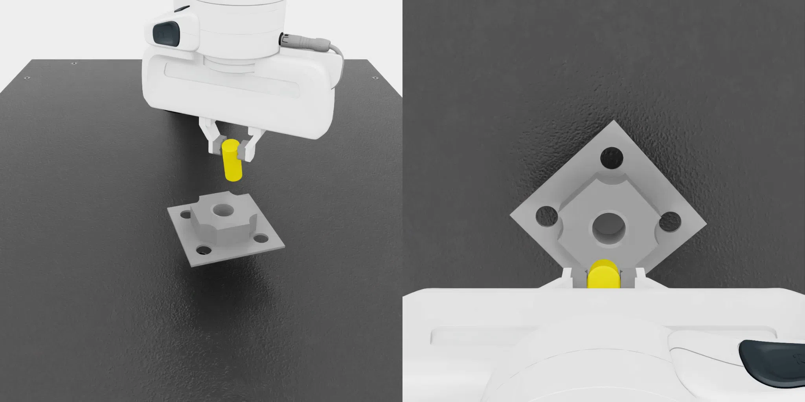
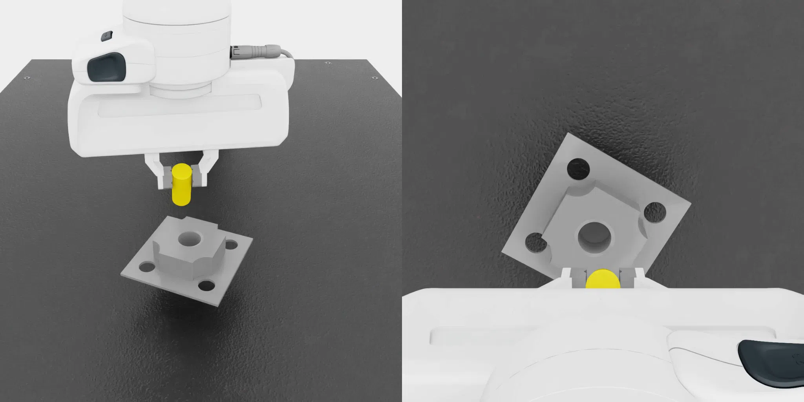

# FR3 Peg Insert

<div align="center">

[](https://www.python.org/)
[](https://github.com/isaac-sim/IsaacLab)
[](https://github.com/Denys88/rl_games)
[](https://github.com/ARISE-Initiative/robomimic)
[](https://developer.nvidia.com/cuda-zone)

</div>

基于 NVIDIA Isaac Lab 的 Franka FR3 peg-in-hole 任务。FR3 夹持 20 mm 圆柱 peg，并将其插入 23 mm 圆孔 fixture，用于学习接触丰富的装配策略。

仓库同时提供两个任务：

- 低维强化学习任务 `Isaac-Fr3-Peg-Insert-Direct-v0`，使用 RL-Games PPO + LSTM 训练 teacher。
- 新增视觉模仿学习任务 `Isaac-Fr3-Peg-Insert-Visuomotor-Direct-v0`，使用桌面相机和腕部相机观测，支持从 RL teacher 录制 robomimic HDF5 数据并训练 BC-RNN 图像策略。

<div align="center">
  
  
</div>

## 概览

| 项目 | 低维 RL 任务 | 视觉模仿学习任务 |
| --- | --- | --- |
| Task ID | `Isaac-Fr3-Peg-Insert-Direct-v0` | `Isaac-Fr3-Peg-Insert-Visuomotor-Direct-v0` |
| 策略观测 | 末端位姿、速度、peg/hole 相对状态 | `proprio`、`table_cam`、`wrist_cam` |
| Critic / teacher 状态 | 非对称 privileged state | 录制时由低维 teacher 重建低维观测 |
| 算法配置 | `agents/rl_games_ppo_cfg.yaml` | `agents/bc_rnn_image_200.json` |
| 默认并行环境 | 128 | 128，录制 HDF5 时当前脚本使用 1 |

仿真默认 120 Hz，`decimation=8`，控制频率 15 Hz，episode 长度 10 s。策略输出 6D 末端增量动作，底层使用任务空间阻抗控制生成关节力矩。reset 时会随机化 hole 平面位置、yaw，以及 peg 在夹爪中的初始位姿。

核心代码位于：

```text
source/fr3_peg_insert/fr3_peg_insert/tasks/direct/fr3_peg_insert/
```

## 安装

先安装 Isaac Lab：

<https://isaac-sim.github.io/IsaacLab/main/source/setup/installation/index.html>

安装本扩展：

```bash
python -m pip install -e source/fr3_peg_insert
```

如果使用 Isaac Lab launcher：

```bash
PATH_TO_isaaclab.bat -p -m pip install -e source/fr3_peg_insert
```

Linux 环境将 `isaaclab.bat` 替换为 `isaaclab.sh`。

## 训练低维 RL Teacher

```bash
python scripts/rl_games/train.py \
  --task Isaac-Fr3-Peg-Insert-Direct-v0 \
  --num_envs 128 \
  --max_iterations 200
```

日志和 checkpoint 默认保存到：

```text
logs/rl_games/Factory/<experiment_name>/
```

## 录制视觉 HDF5 数据

`record_hdf5_from_rl_teacher.py` 会运行视觉任务，但使用已训练好的低维 RL-Games teacher 产生动作。导出的 HDF5 包含：

```text
data/demo_*/obs/proprio
data/demo_*/obs/table_cam
data/demo_*/obs/wrist_cam
data/demo_*/actions
data/demo_*/rewards
data/demo_*/dones
```

示例：

```bash
python scripts/imitation_learning/robomimic/record_hdf5_from_rl_teacher.py \
  --task Isaac-Fr3-Peg-Insert-Visuomotor-Direct-v0 \
  --teacher_task Isaac-Fr3-Peg-Insert-Direct-v0 \
  --checkpoint logs/rl_games/Factory/test/nn/Factory.pth \
  --output_file datasets/fr3_peg_insert_visuomotor.hdf5 \
  --num_demos 100 \
  --horizon 400 \
  --num_success_steps 10 \
  --enable_cameras
```

## 训练视觉 BC-RNN 策略

使用任务注册的 robomimic 配置：

```bash
python scripts/imitation_learning/robomimic/train.py \
  --task Isaac-Fr3-Peg-Insert-Visuomotor-Direct-v0 \
  --algo bc \
  --dataset datasets/fr3_peg_insert_visuomotor.hdf5
```

robomimic 日志默认写入：

```text
logs/robomimic/Isaac-Fr3-Peg-Insert-Visuomotor-Direct-v0/
```

## 回放视觉策略

```bash
python scripts/imitation_learning/robomimic/play.py \
  --task Isaac-Fr3-Peg-Insert-Visuomotor-Direct-v0 \
  --checkpoint logs/robomimic/Isaac-Fr3-Peg-Insert-Visuomotor-Direct-v0/<exp>/models/model_epoch_*.pth \
  --num_envs 4 \
  --num_rollouts 20 \
  --horizon 800 \
  --enable_cameras
```

如果训练时使用了 `--normalize_training_actions`，回放时需要同步传入 `--norm_factor_min` 和 `--norm_factor_max`。

## 配置入口

| 文件 | 说明 |
| --- | --- |
| `fr3_peg_insert_env.py` | Direct RL 环境、观测、奖励、reset 和成功判定 |
| `fr3_peg_insert_env_cfg.py` | FR3、peg/hole 资产、随机化、仿真、控制参数和视觉任务相机配置 |
| `control.py` | 任务空间控制与 IK 工具 |
| `utils.py` | 观测拼接、关键点、资产位姿和物理属性辅助函数 |
| `agents/rl_games_ppo_cfg.yaml` | 低维 RL-Games PPO/LSTM teacher 配置 |
| `agents/bc_rnn_image_200.json` | 视觉 robomimic BC-RNN 配置，使用 200x200 双 RGB 相机 |

## 开发

```bash
pip install pre-commit
pre-commit run --all-files
```

## 参考

- Isaac Lab: <https://github.com/isaac-sim/IsaacLab>
- RL-Games: <https://github.com/Denys88/rl_games>
- robomimic: <https://github.com/ARISE-Initiative/robomimic>
- ManiSkill: <https://github.com/haosulab/ManiSkill>
- RoboCasa: <https://github.com/robocasa/robocasa>
- LeRobot: <https://github.com/huggingface/lerobot>
