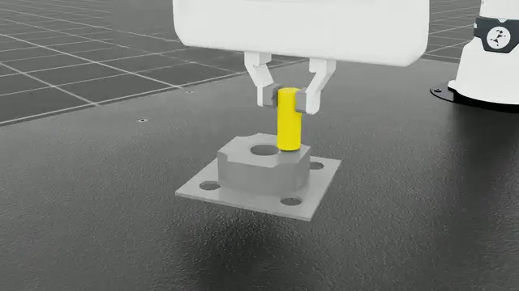

# FR3 Peg Insert

<div align="center">

[](https://www.python.org/)
[](https://github.com/isaac-sim/IsaacLab)
[](https://github.com/Denys88/rl_games)
[](https://developer.nvidia.com/cuda-zone)

</div>

基于 NVIDIA Isaac Lab 的 Franka FR3 插孔强化学习环境。任务中，FR3 夹持 20 mm 圆柱 peg，并将其插入 23 mm 圆孔 fixture，用于学习接触丰富的 peg-in-hole 装配策略。

<div align="center">
  
</div>

## 概览

- **Task ID**：`Isaac-Fr3-Peg-Insert-Direct-v0`
- **仿真设置**：120 Hz，decimation 8，默认 128 个并行环境，episode 长度 10 s
- **控制方式**：策略输出 6D 末端增量，底层任务空间阻抗控制生成关节力矩
- **训练方式**：RL-Games PPO + LSTM，非对称 actor-critic
- **随机化**：reset 时随机 hole 平面位置、yaw，以及 peg 在夹爪中的初始位置
- **成功判定**：peg 底部水平误差小于 `5 mm`，高度低于 `success_threshold` 阈值

核心代码位于：

```text
source/fr3_peg_insert/fr3_peg_insert/tasks/direct/fr3_peg_insert/
```

## 安装

先安装 Isaac Lab：

<https://isaac-sim.github.io/IsaacLab/main/source/setup/installation/index.html>

安装本扩展：

```bash
python -m pip install -e source/fr3_peg_insert
```

若使用 Isaac Lab launcher：

```bash
PATH_TO_isaaclab.bat -p -m pip install -e source/fr3_peg_insert
```

Linux 环境将 `isaaclab.bat` 替换为 `isaaclab.sh`。

## 快速验证

```bash
python scripts/list_envs.py --keyword Fr3
python scripts/zero_agent.py --task Isaac-Fr3-Peg-Insert-Direct-v0 --num_envs 16
python scripts/random_agent.py --task Isaac-Fr3-Peg-Insert-Direct-v0 --num_envs 16
```

## 训练

```bash
python scripts/rl_games/train.py \
  --task Isaac-Fr3-Peg-Insert-Direct-v0 \
  --num_envs 128 \
  --max_iterations 200
```

日志默认保存在 `logs/rl_games/Factory/<experiment_name>/`。

## 回放

```bash
python scripts/rl_games/play.py \
  --task Isaac-Fr3-Peg-Insert-Direct-v0 \
  --checkpoint logs/rl_games/Factory/test/nn/Factory.pth \
  --num_envs 16 \
  --real-time
```

## 评估

```bash
python scripts/rl_games/test_success_rate.py \
  --task Isaac-Fr3-Peg-Insert-Direct-v0 \
  --checkpoint logs/rl_games/Factory/test/nn/Factory.pth \
  --num_envs 128 \
  --num_episodes 1024
```

## 配置入口

| 文件 | 说明 |
| --- | --- |
| `fr3_peg_insert_env.py` | Direct RL 环境、奖励、reset 和成功判定 |
| `fr3_peg_insert_env_cfg.py` | 机器人、资产、随机化、仿真和控制参数 |
| `control.py` | 任务空间控制与 IK 工具 |
| `utils.py` | 观测拼接、关键点、资产位姿和物理属性辅助函数 |
| `agents/rl_games_ppo_cfg.yaml` | RL-Games PPO/LSTM 训练配置 |

## 开发

```bash
pip install pre-commit
pre-commit run --all-files
```

## 参考

- Isaac Lab: <https://github.com/isaac-sim/IsaacLab>
- RL-Games: <https://github.com/Denys88/rl_games>
- ManiSkill: <https://github.com/haosulab/ManiSkill>
- RoboCasa: <https://github.com/robocasa/robocasa>
- LeRobot: <https://github.com/huggingface/lerobot>
